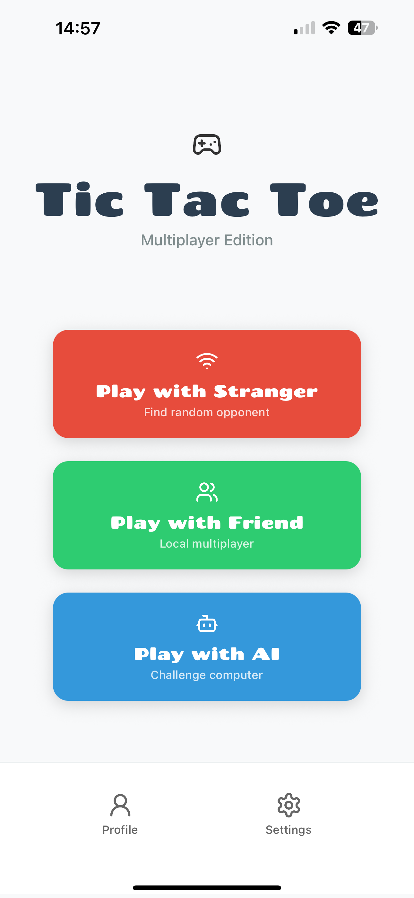
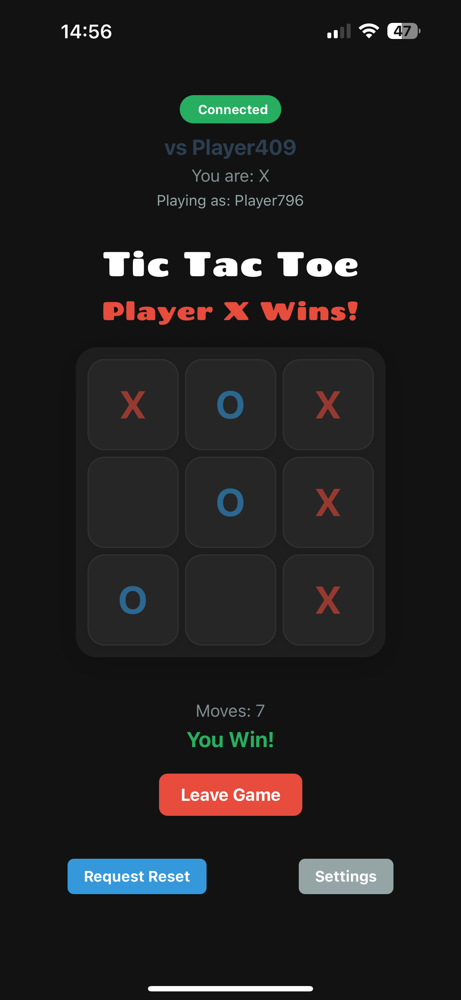
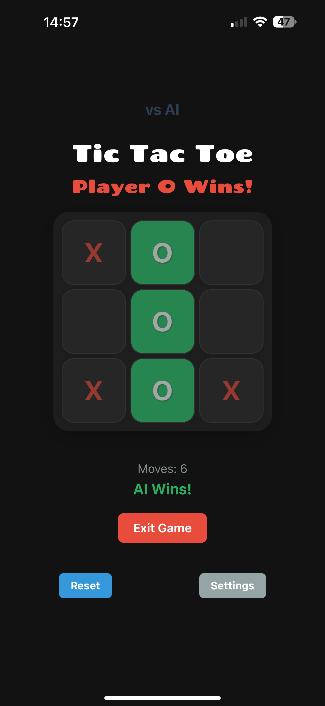
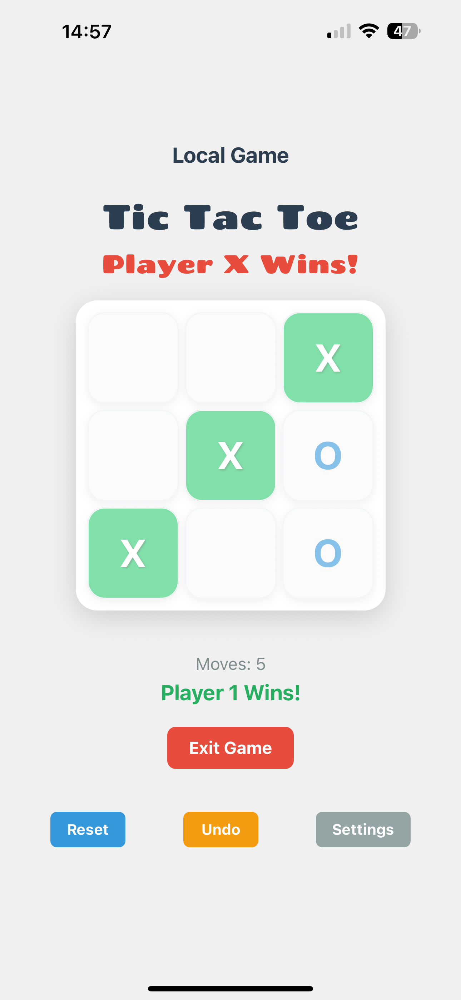

# Tic Tac Toe Mobile Game 

A modern, multiplayer Tic Tac Toe game built with React Native and Expo.

<div style="display: flex; gap: 20px; justify-content: center; align-items: center;">
    
    
    
    
</div>

## Features

- Classic Tic Tac Toe gameplay
- Multiplayer mode with real-time updates
- Beautiful and modern user interface
- Mobile-first design
- Responsive layout for different screen sizes

## Technologies Used

- React Native
- Expo
- JavaScript/JSX
- Custom Assets and Fonts

### Backend
- Socket.IO for real-time communication
- Node.js for server-side logic
- Express.js for API endpoints

## Getting Started

### Prerequisites

- Node.js (12.0 or later)
- npm or yarn
- Expo CLI
- A mobile device or emulator

### Installation

1. Clone the repository:
```bash
git clone [your-repository-url]
```

2. Navigate to the project directory:
```bash
cd tic-tac-toe-multiplayer
```

3. Install dependencies:
```bash
npm install
# or
yarn install
```

4. Start the development server:
```bash
npm start
# or
yarn start
```

5. Use the Expo Go app on your mobile device to scan the QR code, or run on an emulator.

## Contributing

Contributions are welcome! Please feel free to submit a Pull Request.

## License

This project is licensed under the MIT License - see the LICENSE file for details.

### ToDo
- [ ] Settings page
- [ ] authentication
- [ ] Leaderboard