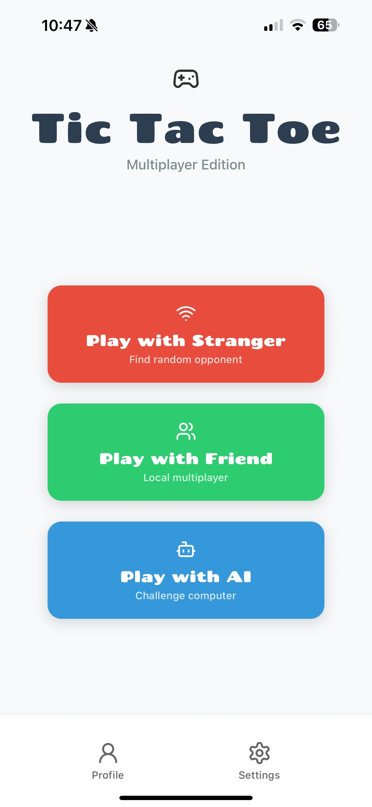

# Tic Tac Toe Mobile Game (Work in progress 🏗️)

A modern, multiplayer Tic Tac Toe game built with React Native and Expo.



## Features

- Classic Tic Tac Toe gameplay
- Beautiful and modern user interface
- Custom font integration (Chango)
- Mobile-first design
- Responsive layout for different screen sizes
- Adaptive icons and splash screens

## Technologies Used

- React Native
- Expo
- JavaScript/JSX
- Custom Assets and Fonts

## Getting Started

### Prerequisites

- Node.js (12.0 or later)
- npm or yarn
- Expo CLI
- A mobile device or emulator

### Installation

1. Clone the repository:
```bash
git clone [your-repository-url]
```

2. Navigate to the project directory:
```bash
cd tic-tac-toe-multiplayer
```

3. Install dependencies:
```bash
npm install
# or
yarn install
```

4. Start the development server:
```bash
npm start
# or
yarn start
```

5. Use the Expo Go app on your mobile device to scan the QR code, or run on an emulator.

## Project Structure

```
tic-tac-toe-multiplayer/
├── app.json           # Expo configuration
├── index.js          # Entry point
├── package.json      # Dependencies and scripts
├── assets/          # Static assets
│   ├── adaptive-icon.png
│   ├── favicon.png
│   ├── icon.png
│   ├── splash-icon.png
│   └── fonts/
│       └── Chango-Regular.ttf
└── src/
    └── App.jsx      # Main application component
```

## Contributing

Contributions are welcome! Please feel free to submit a Pull Request.

## License

This project is licensed under the MIT License - see the LICENSE file for details.
